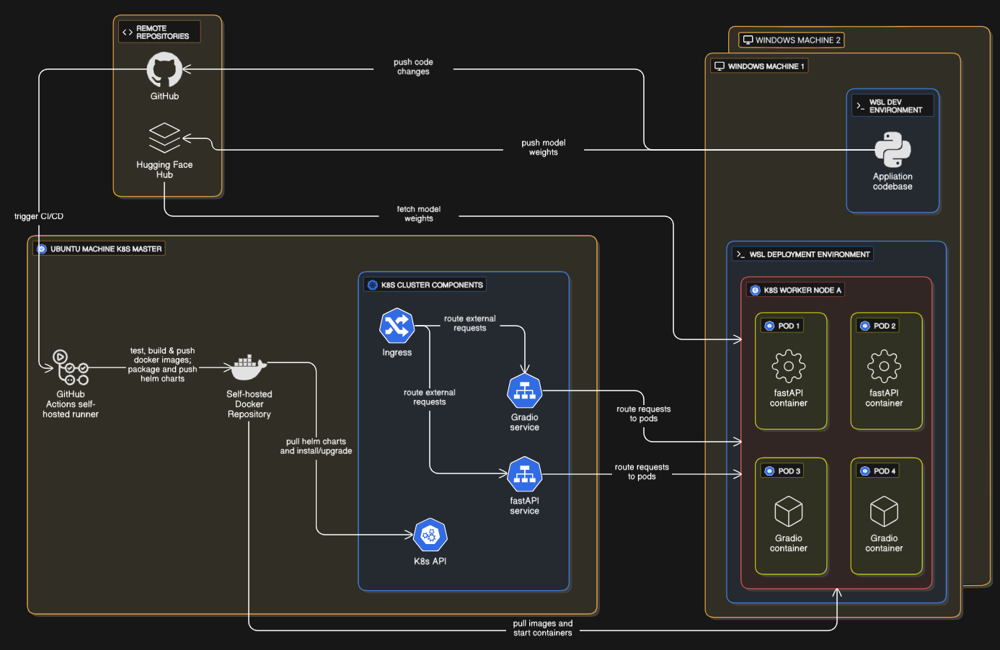
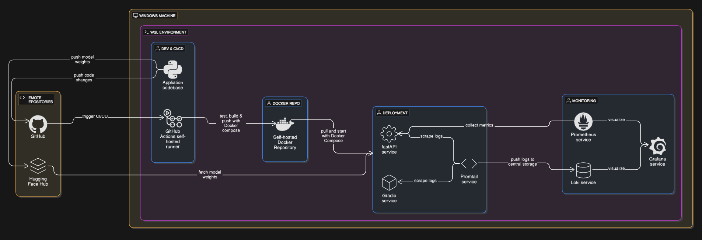

# huggingface_model_deployment


## Project Overview
This project is a hands-on DevOps/MLOps exercise focused on deploying a HuggingFace LoRA-based sentiment analysis model using best practices for productionization, CI/CD, security, monitoring, and scalable infrastructure using Kubernetes. The goal is to demonstrate a full ML product lifecycle, from model training to robust, observable, and secure deployment.

## Key Features
- **Model**: Fine-tuned HuggingFace transformer (LoRA) for movie sentiment analysis
- **API**: FastAPI backend for inference, metrics, and health endpoints
- **UI**: Gradio frontend for interactive predictions
- **Dependency Management**: Poetry for streamlined dependency resolution, virtual environment isolation, and reproducible builds
- **Containerization**: Separate Docker containers for backend and UI, managed with Docker Compose for local development and testing purposes
- **Artifact Management**: Self-hosted Docker registry used for storing container images and Helm charts
- **Orchestration**: Kubernetes manifests and Helm charts for scalable, production-grade deployment on an on-prem cluster with 3 GPU enabled nodes
- **Networking**: Ingress controller configured for HTTP routing to backend and UI services
- **CI/CD**: GitHub Actions with a self-hosted runner, automated builds, tests (orchestrated with Nox), and releases
- **Testing**: Unit, integration, and coverage reports
- **Code Quality**: Linting (ruff), type checking (mypy), security (bandit, pip-audit)
- **Monitoring**: Prometheus metrics, Loki logs, and Grafana dashboards. Set-up of the monitoring environment can be found here [central monitoring repository](https://github.com/KristofarStavrev/central-monitoring)
- **Security**: Basic auth for metrics, secrets management, and security scanning

## Project Structure
```
src/                      # Main application code (FastAPI, Gradio, model utils)
docker/                   # Dockerfiles for backend, frontend, and test jobs
helm-chart-sentiment-app/ # Helm chart for Kubernetes deployment
k8s/                      # Raw Kubernetes manifests
tests/                    # Unit and integration tests
promtail/                 # Configuration for promtail log scraping
.github/workflows/        # CI/CD pipeline
notebooks/                # Model training and experimentation
docs/img/                 # Architecture, infra, and dashboard diagrams
Makefile                  # Common build/test commands
pyproject.toml            # Poetry project config and dependencies
poetry.lock               # Poetry lock file
noxfile.py                # Nox automation for test/lint workflows
docker-compose.yml        # Local multi-container orchestration
TODO                      # Project plan and future roadmap
```

## Architecture Diagrams
**Kubernetes cluster deployment**


**Local deployment - was established and used before the K8s cluster**


## How to Run Locally

1. **Clone the repo**

3. **Set environment variables** (example):
   ```bash
   export REGISTRY_URL=local
   export PROMETHEUS_METRICS_USER=admin
   export PROMETHEUS_METRICS_PASS=secret
   export FASTAPI_URL=http://fastapi:8000
   export LOKI_URL=http://localhost:3100
   ```

4. **Build and start Docker images using Docker Compose**:
   ```bash
   REGISTRY_URL=$REGISTRY_URL docker compose -f docker-compose.yml up --build
   ```

5. **Access the services:**
   - FastAPI: http://localhost:8000
   - Gradio UI: http://localhost:7860

> **Note:**
> - The CI/CD pipeline in `.github/workflows/ci-cd.yaml` demonstrates how to authenticate and push images to a self-hosted registry. For local development, the above steps avoid pushing the images to a repository for simplicity.
> - Make sure your environment variables match those expected in `docker-compose.yml`.

## Kubernetes & Helm Deployment

0. **Prerequisites**
   - An on-prem Kubernetes cluster with GPU-enabled nodes
   - Access to a self-hosted Docker image registry
   - [Helm](https://helm.sh/) installed locally

1. **Clone the repo**

2. **Build and push Docker images to your self-hosted registry**
   - Set the `REGISTRY_URL` environment variable to your registry (e.g., `export REGISTRY_URL=your.registry:5000`)
   - Authenticate to your registry if required (see CI/CD pipeline for example)
   - Build and push images:
     ```bash
     REGISTRY_URL=$REGISTRY_URL docker compose -f docker-compose.yml build
     REGISTRY_URL=$REGISTRY_URL docker compose -f docker-compose.yml push
     ```

3. **Customize Helm values**
   - Edit `helm-chart-sentiment-app/values.yaml` values to your preferences or leave as is for default
   - Create a `values-secret.yaml` file which contains:
        ```yaml
        image_repository: "your.registry:5000"
        fast_api_secret_prometheus_user: base64 encoded user
        fast_api_secret_prometheus_password: base64 encoded password
        ```

4. **Install the Helm chart**
   - **Option 1: From local chart directory**
     ```bash
     helm install sentiment-app ./helm-chart-sentiment-app
     ```
   - **Option 2: From OCI registry (if you pushed the chart as in CI/CD)**
     ```bash
     helm registry login your.registry:5000
     helm install sentiment-app oci://your.registry:5000/helm-charts/helm-chart-sentiment-app --version <chart_version>
     ```

5. **Monitor and manage your deployment**

   - Use `kubectl`, `k9s`, and `helm` to manage and troubleshoot your deployment.

> **Note:**
> - The images referenced in your Helm values must be accessible by your Kubernetes cluster (i.e., pushed to a registry the cluster can pull from).
> - The CI/CD pipeline in `.github/workflows/ci-cd.yaml` provides a full example of this workflow, including registry authentication and Helm chart packaging.

## Testing & Code Quality
- **Run all tests, linting, and security scans (locally):**
  ```bash
  make run-nox-tests
- **Generate test coverage report (locally):**
  ```bash
  make run-pytests-coverage-html
  ```
- **Coverage report:**
  

## Monitoring & Observability
- **Prometheus**: Scrapes FastAPI `/metrics` endpoint for custom and default metrics
- **Loki & Promtail**: Collects logs from all Docker containers
- **Grafana**: Dashboards for metrics and logs
  
  
  

## Security Practices
- Bandit and pip-audit for static analysis and dependency scanning
- Basic authentication for sensitive endpoints
- Secrets managed via Kubernetes secrets and GitHub secrets

## Main Technologies Used
- Python 3.10, FastAPI, Gradio, HuggingFace Transformers, LoRA, PyTorch
- Docker, Docker Compose, Poetry
- Kubernetes, Helm
- Prometheus, Grafana, Loki, Promtail
- GitHub Actions
- Nox, pytest, ruff, mypy, bandit, pip-audit

## Future Improvements
See the `TODO` file for a detailed roadmap, including:
- Set-up and enable monitoring on the K8s cluster
- Explore ELK stack and potential use cases for Kafka
- Implement KServe for easier model deployment
- Advanced CI/CD (feature branch workflows, alternative tools like Jenkins, ArgoCD, CircleCI)
- More strict code styling and pre-commit hooks
- Cloud deployment using Terraform
- Model tracking, data drift, and automated retraining (Evidently)
- ML serving at scale (TorchServe, Triton, etc.)
- Introduce DVC for storing and versioning data and model weights
- Explore distributed computing and GPU accelerated data science (Spark, Dask, CuDF, CuML)
- Modularize the existing training notebook
- Documentation with MkDocs/Sphinx
