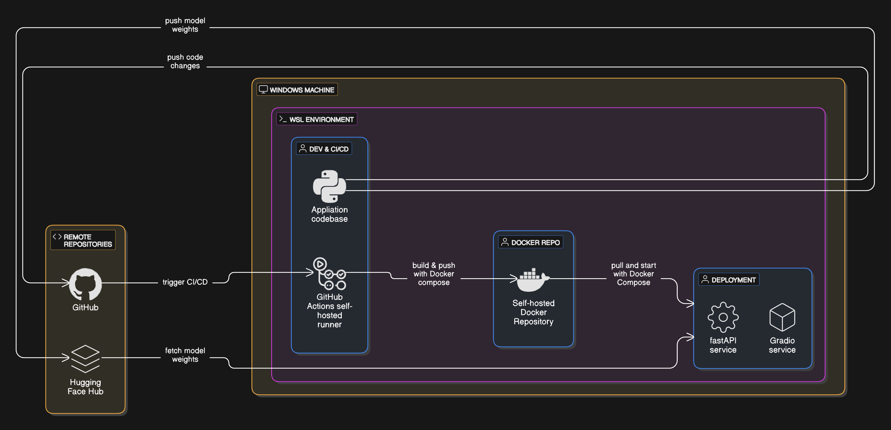
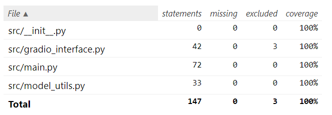
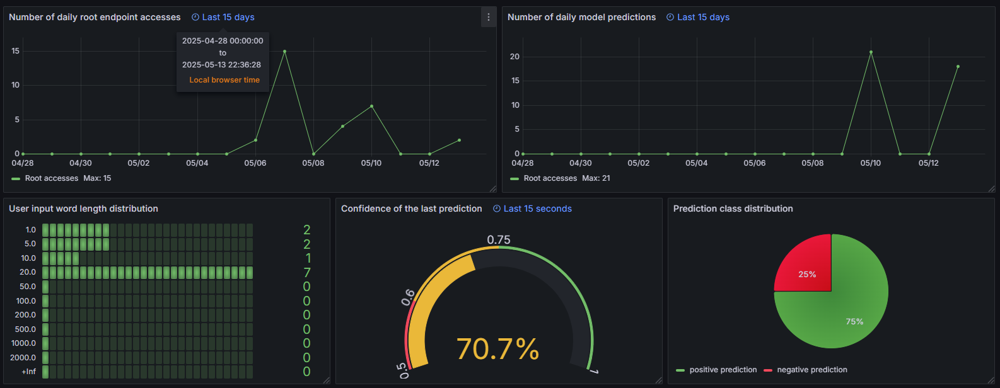
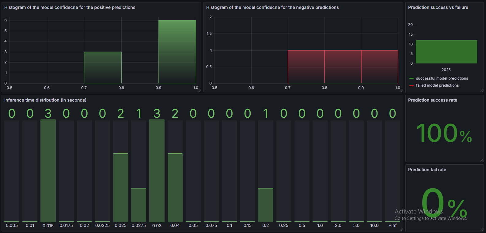
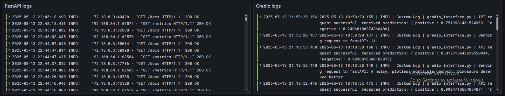

# huggingface_model_deployment

## Current infrastructure

## Tests coverage report

## Grafana Dashboard with Prometheus metrics and Loki logs

## TODO:
- [X] Upload model to HuggingFace modelhub
- [X] Productionize and modularize notebook code
- [X] Makefile
- [X] Dockerize
    - [X] Integrate poetry
    - [X] Separate the fastAPI backend and gradio frontend services in different containers
    - [X] Handle them with Docker compose
- [X] GitHub CI/CD
    - [X] Use a self-hosted CI/CD runner
    - [X] Use a self-hosted docker image repository
    - [X] Self-host the deployment environment
    - [X] Clean-up old images/containers on the prod server
    - [X] Enable image caching in the self-hosted runner
    - [X] Migrated the runner to a dedicated machine
    - [X] Create an automated release when a new tag is created
    - [ ] FOR FUTURE IMPROVEMENTS: Tag docker images with release/commit tag
    - [ ] FOR FUTURE IMPROVEMENTS: Alternative tools would be Jenkins, Argo, CircleCI
- [X] Code styling, linting, security and tests
    - [X] Pytest for unit/mock/integration tests
    - [X] Code coverage
    - [X] Bandit and pip-audit for catching security flaws
    - [X] Mypy for typechecking
    - [X] ruff for linting
    - [X] Integrate tests in the CI/CD (Optionally use Nox to orchestrate)
    - [ ] FOR FUTURE IMPROVEMENTS: More strict code styling and introduce pre-commit hooks
    - [ ] FOR FUTURE IMPROVEMENTS: Stub files that mypy can use for the custom modules (model_utils.py)
- [ ] Logs and messages
    - [X] Logging in all src codes
    - [X] Loki + Promtail
    - [X] Prometheus
    - [X] Grafana
    - [X] Create metrics for Prometheus
    - [X] Create a few Grafana dashboards
    - [ ] FOR FUTURE IMPROVEMENTS: Kafka
    - [ ] FOR FUTURE IMPROVEMENTS: ELK (Elasticsearch, Logstash, Kibana)
- [ ] Deployment and orchestration
    - [X] Kubernetes theoretical + terminology - cluster, master, workers, nodes, pods, deployment, service, ConfigMaps, secrets, ingress, HorizontalPodAutoscaler, rolling updates, probes (liveness/readiness)
    - [ ] Kubernetes practical
        - [X] Set-up the full-scale-like production like cluster with multiple machines
        - [X] Move the self hosted docker image repository on the cluster
        - [X] Set-up the GPUs on the K8s cluster
        - [X] Deploy the App using a raw K8s manifest
        - [X] Test what happens on simulated node failures (+ that the old deployment is stopped correctly)
        - [X] Add an Ingress component
        - [X] Allow the containers to use the GPU
        - [ ] Helmify the kubernetes yaml manifests
        - [ ] Update the CI/CD to work with the new Helm deployment
        - [ ] FOR FUTURE IMPROVEMENTS: Handle monitoring (Promtail, Loki, Prometheus, Grafana) in the cluster
    - [X] K9s workflow
    - [ ] Kserve basic understanding
    - [ ] Kubeflow basic understanding
    - [ ] FOR FUTURE IMPROVEMENTS: Kserve practical
    - [ ] FOR FUTURE IMPROVEMENTS: Kubeflow practical
- [ ] Code refactoring and finishing touches
    - [ ] Training/Validation/Testing scripts and modularity
    - [ ] Create an diagram for the entire architecture (CI/CD, K8s cluster, etc.)
    - [ ] Documentation for the GitHub Read.me - how to start the app, etc.
    - [ ] FOR FUTURE IMPROVEMENTS: Documentation with MkDocs / Sphinx
- [ ] FOR FUTURE IMPROVEMENTS: Deploy in AWS - EC2 or ECS
- [ ] FOR FUTURE IMPROVEMENTS: Terraform/Ansible for infrastructure
- [ ] FOR FUTURE IMPROVEMENTS: User feedback system for model accuracy, Model tracking, data drift tracking, automated retraining (Evidently)
- [ ] FOR FUTURE IMPROVEMENTS: Airflow/Dagster/Prefect/Argo
- [ ] FOR FUTURE IMPROVEMENTS: Weights & Biases (W&B) - paid alternative to MLflow
- [ ] FOR FUTURE IMPROVEMENTS: ONNX/TorchScript (for Pytorch environment) - used to serialize and export models for cross-framework compatibility and efficient inference
- [ ] FOR FUTURE IMPROVEMENTS: TorchServe / TensorFlow Serving / Triton Inference Server - for serving models at scale
- [ ] FOR FUTURE IMPROVEMENTS: DVC for storing and versioning data and model weights
- [ ] FOR FUTURE IMPROVEMENTS: Distributed Computing - Dask, Spark
- [ ] FOR FUTURE IMPROVEMENTS: GPU accelerated data science: CuDF, CuML
- [ ] FOR FUTURE IMPROVEMENTS: Feature stores
- [ ] FOR FUTURE IMPROVEMENTS: PyTorch Lightning - streamline the process of developing, training, and scaling deep learning pytorch models

Useful MLOps learning path: https://github.com/graviraja/MLOps-Basics
